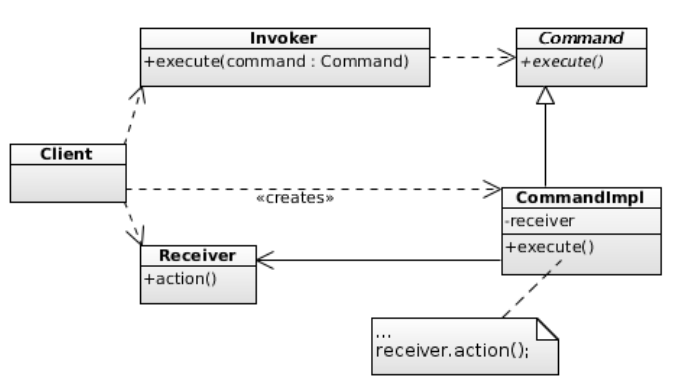

# Introduction

Le modèle commande est un modèle de conception réutilisable visant à encapsuler la notion d'invocation d'une méthode sur un objet donné. Il permet ainsi de complètement séparer l'initiateur de cet appel du code de l'action lui-même. De ce principe découle plusieurs aspects intéressants:

- Aspect d'invocation beaucoup plus générique au moyen d'interfaces
- Découplage facilité, le modèle commande se marie aisément avec le concept de *do* et *undo* d'opérations
- permet la construction de composants génériques et hautement réutilisables nécessitant la délégation ou l'exécution différée de méthodes

## Représentation

Le modèle commande de base est modélisé ainsi

On trouve généralement toujours (plus ou moins adapté)

- Un `Receiver`, l'objet dont on veut encapsuler l'appel d'une méthode dans une commande. Sur le schéma, on souhaite ainsi encapsuler la méthode `receiver.action()`.
- Une interface `Command` qui défini une méthode `execute()` responsable de l'exécution de l'appel d'une méthode sur un objet donné
- Un `Invoker` qui s'occupera d'appeler la méthode `execute()` sur les commandes qui lui sont passées
- Une implémentation de Commande qui encapsule ainsi l'appel à la méthode du `Receiver`.

## Contexte

L'appel de la méthode d'un objet dépend d'un contexte donné qui sont les arguments et autres supports dont elle a besoin pour s'exécuter. Ainsi, la création d'une commande doit encapsuler ce contexte afin de fonctionner.

Ceci permet notamment de maintenir en mémoire les différents contextes d'exécutions des commandes (exécutions successives), dans le cas du *do/undo* afin de pouvoir librement naviguer dans l'historique de ces exécutions.

## Inconvénients

Le modèle commande introduit un nombre important de classes nécessaires pour fonctionner. L'encapsulation de l'appel d'une méthode d'un objet donné nécessite une nouvelle commande. Ainsi, ce modèle de conception se prête allegrement avec les langages supportants les lambda expressions et/ou les classes anonymes, permettant de définir les implémentations des commandes simplement et rapidement.

# Conclusion

la réalisation de ce projet a été très intéressante notamment pour approfondir la découverte et la puissance du modèle. Nous avons néanmoins observé beaucoup de difficultés dans l'implémentation de notre projet, pas forcément lié au modèle mais plutôt à nos objectifs.

## Développement

Lors de l'élaboration du schéma UML et de la reflexion sur la logique et la structure du projet, le modèle commande semblait être aisé à implémenter tout en permettant une grande simplification du code par le découplage des composants. 

Néanmoins étant la première fois que nous l'implémentions ainsi nous avons tout simplement sous-estimé l'accès à l'information. Notre application a été développée suivant le modèle MVC en plus du modèle commande, et l'accès au modèle s'est avéré plus difficile que prévu engendrant un développement parfois un peu archaique accompagné d'un peu de code spaghetti qui fut long à factoriser. 

Malgré ces quelques difficultés prononcées ça a été un projet très intéressant et amusant à développer. Nous avons pris beaucoup de plaisir à imaginer un petit univers pour notre jeu et sommes globalement satisfaits du résultat, même si il est littéralement impossible de faire une interface graphique jolie et visuellement acceptable avec Swing.